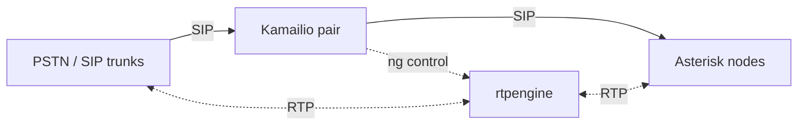

# Telephony Infrastructure

The plumbing underneath [Call Routing](call-routing.md): the carrier
connections, the physical phones, the media relays, and the settings that
decide what happens when a call fits none of your rules.

Everything on this page is platform-level and super-admin only. Clients never
see any of it — the platform owns their trunks and extensions.

## SIP trunks

**Telephony → SIP Trunks.** A trunk is a connection to a carrier.

| Field | Purpose |
|---|---|
| **Name** | What you call this carrier connection |
| **Provider** | The carrier behind it |
| **Host / Port / Transport** | Where to reach them, over UDP, TCP or TLS |
| **Username / Password** | Credentials, where the trunk registers |
| **Register** | Whether Orbital registers to the carrier, or the carrier sends to a static address |
| **Codecs** | The codecs offered, in preference order |
| **Max channels** | A ceiling on simultaneous calls over this trunk |
| **Inbound context** | The dialplan context inbound calls land in |
| **Client** | Optional. Leave unset for a trunk shared across clients |

Trunks are shared across clients by default. Individual numbers are what get
assigned per client, on the client's Numbers sub-page.

Saving a trunk regenerates Asterisk configuration. Do it in a maintenance
window rather than mid-shift.

## Phone extensions

**Telephony → Phone Extensions.** Hardware you can plug a device into — desk
phones, analog adapters, and standalone SIP clients.

| Field | Purpose |
|---|---|
| **Number** | The extension number |
| **Label** | Who or what it is |
| **Type** | SIP phone, ATA, desktop softphone, or WebRTC client |
| **Transport** | UDP, TCP, TLS, or WSS. WebRTC clients use WSS |
| **SIP username / password** | Device credentials |
| **Context** | The dialplan context the extension dials from |
| **Recording mode** | Inherit from client and platform, always record, or never record |

Two kinds of extension deliberately do **not** appear in this list:

- **Staff softphones** are allocated automatically as WebRTC extensions when
  you create a staff user, and managed from that user's page under
  **Platform → Staff**.
- **Client extensions** — AI agents and virtual numbers — live inside each
  client, on the client's Extensions sub-page.

So an empty-looking extension list on a working platform is normal. It means
everyone is on a browser softphone and nothing is plugged into a wall.

## Hold music

**Telephony → Hold Music.** Each row is one Asterisk music-on-hold class, read
by the dialplan generator at config-push time.

A class is either a **stream** — an Icecast URL and a format, MP3, Ogg Vorbis,
AAC or WAV — or a **file set**.

**Use the stream type.** File upload is not built yet; selecting the file type
tells you so. Point a stream at the bundled Icecast container or at an external
one.

The built-in `default` class cannot be renamed or deleted, so that existing
dialplan references stay stable.

## Telephony settings

**Telephony → Settings.** Two things, both worth setting before you take real
traffic.

### Unmatched inbound calls

What happens to a call whose dialled number matches no client DID. Wrong
numbers, a DID removed from a client but still live at the carrier, a carrier
sending you somebody else's traffic.

| Action | Behavior |
|---|---|
| **Reject the call with a SIP code** | The carrier gets a definite answer. Set the code |
| **Play a message and hang up** | The caller hears something rather than silence |
| **Forward to a specific client** | A catch-all account picks it up |

### Outage handling

The last-resort behavior when the normal call path cannot be reached at all —
LiveKit down, no operators, agent worker dead.

| Action | Behavior |
|---|---|
| **Take voicemail** | The caller leaves a message; you still have the contact |
| **Play message and hang up** | Honest, and better than a ring that never ends |
| **Reject the call with a SIP code** | The carrier may then try its own failover |

Alongside it: hold music and a maximum hold time for callers caught in the
outage, plus a notification email and a cooldown so an outage does not also
become a mail flood.

This is the setting that decides what your clients' callers hear on your worst
day. Choose it deliberately rather than leaving the default.

## The SIP edge

On a production deployment, Kamailio fronts the SIP traffic and rtpengine
relays the media, both on dedicated hosts outside the cluster.



### Why a proxy in front of Asterisk

Asterisk could take trunk traffic directly. Kamailio is in front of it for
three reasons:

- **Draining.** You can stop sending new calls to one Asterisk node while the
  calls already on it finish naturally. Without this, maintenance means
  dropping live calls.
- **Multiple backends.** Adding an Asterisk node is a row in a registry rather
  than a change at your carrier.
- **A security boundary.** SIP-level rate limiting, topology hiding, and access
  control happen at the proxy, so Asterisk only ever sees traffic that has
  already been validated.

### Health probing

Kamailio sends SIP `OPTIONS` pings to each backend every 30 seconds and marks
one that stops answering as down on its own. That is automatic detection
sitting underneath the manual drain controls — a node that dies without anyone
draining it is pulled from the pool without an operator doing anything.

Three admin surfaces cover the edge.

### Asterisk backends

**Telephony → Asterisk Backends.** The registry of Asterisk nodes Kamailio
dispatches to. Each row carries a hostname, SIP port, and AMI host and port.

Every save or delete regenerates Kamailio's dispatcher list from the active
rows and reloads it on **every** Kamailio node in the pair.

Adding a node is two steps, in this order:

1. Launch the Asterisk container, wired to the shared realtime database and
   given its node name.
2. Add the hostname here. Kamailio starts probing it and dispatching to it on
   the next OPTIONS cycle.

Removing is the reverse: deactivate here to pull it from the dispatcher pool
first, then stop the container. Doing it the other way round points the
dispatcher at something that is not there.

### rtpengine nodes

**Telephony → rtpengine Nodes.** The registry of media relays. Each row is one
daemon the platform can target for drain, activate, and statistics, and scrape
for metrics.

Fields cover the control socket host and port, the metrics host and port, and
the recording spool path the upload job drains.

### SIP proxy

**Telephony → SIP Proxy.** A live view of Kamailio: proxy health, active call
count, and the state of each dispatcher backend. From here you can **drain** a
backend — no new calls, existing calls complete naturally — then activate it
again, or disable it hard.

The page polls every few seconds so you can watch "calls remaining" fall to
zero during a drain. It hides itself when Kamailio is not enabled, so installs
without the proxy do not see a dead nav item.

## Regenerating configuration

Asterisk configuration is generated from the database, never hand-edited.
Saving a trunk, extension, queue, or hold music class dispatches a regeneration
job automatically. To force a full rebuild:

```
php artisan orbital:generate-config
```

Two related commands:

- `php artisan orbital:resync-realtime` re-syncs every extension, trunk, and
  queue into the Asterisk realtime tables.
- `php artisan orbital:status` checks whether Asterisk and LiveKit are
  reachable.

All three are also available from **System → Tools**. See
[System Maintenance](system-maintenance.md).

## See also

- [Call Routing](call-routing.md) — what sits on top of this
- [High Availability](high-availability.md) — running these tiers redundantly
- [Call Recording & Voicemail](recording.md) — recording modes and disclosure
